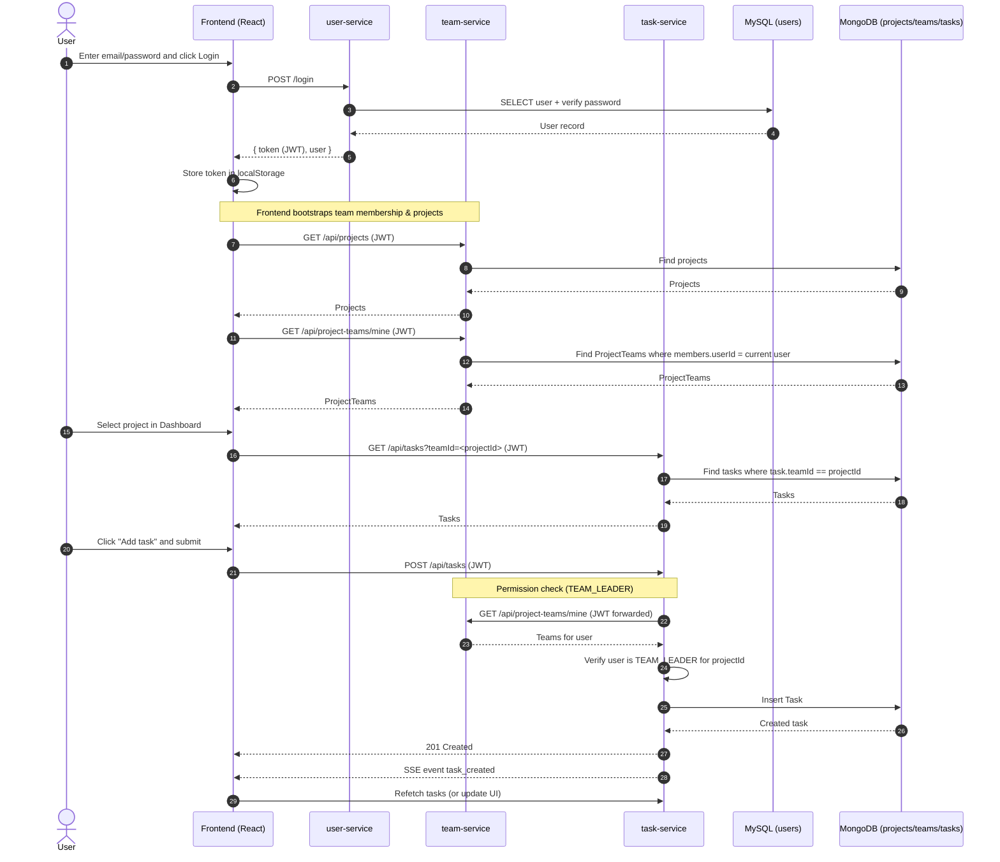

# PMS Project — Full Beginner-Friendly Documentation (Deep Detail)

This document explains the PMS (Project Management System) application **from end to end** in a way that is friendly to someone who is not very experienced with coding. It also includes deeper technical details so you can understand how each part connects.

The PMS is a **microservices** application:
- A **Frontend** (React) that users interact with in the browser
- Multiple **Backend services** (Node/Express) that provide APIs
- Two different databases (MySQL + MongoDB)
- **Real-time updates** using Server-Sent Events (SSE)

---

## Table of Contents

1. What the app does (big picture)
2. How you run it (Docker)
3. The main services and ports
4. How authentication works (JWT)
5. Databases and data models
6. Real-time updates (SSE)
7. Frontend structure (React)
8. Backend structure (Express)
9. Key user flows (step-by-step)
10. Permissions and roles (ADMIN / TEAM_LEADER / MEMBER)
11. Common problems and debugging checklist

---

## 1) What the App Does (Big Picture)

The PMS helps a team manage work using:
- **Projects** (like “Website Redesign”)
- **Teams** assigned to projects
- **Tasks** on a project board (Kanban: TODO / IN_PROGRESS / DONE)

When you choose a project in the Dashboard:
- You see tasks for that project
- If you are the **team leader** of that project’s team, you can create/edit tasks
- You can assign users to tasks

Admin users can:
- Create projects
- Create project teams and assign a project to a team
- Pick the team leader
- Add/remove members

Regular users see only the projects they belong to.

---

## 2) How You Run It (Docker)

This project is designed to run everything using **Docker Compose**.

### Why Docker Compose?
Docker Compose lets you start multiple services (frontend + several backends + databases) with one command.

### Command
From the project root:
- `docker-compose up -d --build`

What this does:
- `--build` rebuilds images if code changed
- `-d` runs in the background

### What Compose Starts
Docker Compose starts:
- MySQL for user-service
- MongoDB for team-service + task-service
- user-service API
- team-service API
- task-service API
- frontend UI

---

## 3) Services and Ports

These are the default URLs when running locally:

- **Frontend (React/Vite)**
  - `http://localhost:5173`

- **User Service (MySQL)**
  - `http://localhost:8080`

- **Team Service (MongoDB)**
  - `http://localhost:8082`

- **Task Service (MongoDB)**
  - `http://localhost:8083`

These are hard-coded in the frontend API clients.

---

## 4) Authentication (JWT) — How Login Works

### What is JWT?
A JWT (JSON Web Token) is a signed string that represents “who you are”.

After login:
- The backend returns a `token`
- The frontend stores it in the browser in `localStorage`
- Every API request attaches the token as:

```
Authorization: Bearer <token>
```

### Where the frontend attaches the token
File:
- `frontend/src/api/client.js`

The app creates axios clients and adds an interceptor:
- Before every request:
  - read `localStorage.getItem('token')`
  - set `config.headers.Authorization`

### What the backend does with the token
Each backend service has middleware that:
- reads the header
- verifies the token using the shared secret
- extracts the user info and attaches it to `req.user`

Example (team-service):
- `team-service/src/middleware/auth.js`

Important:
- The services share the same JWT secret so all services trust tokens created by the user-service.

---

## 5) Databases and Data Models

This project uses **two databases**:

### 5.1 User database (MySQL)
Used only by:
- `user-service`

It stores:
- users
- hashed passwords
- account status (active / pending)
- role (ADMIN / TEAM_LEADER / MEMBER)

### 5.2 Team + Task databases (MongoDB)
Used by:
- `team-service`
- `task-service`

MongoDB stores JSON-like documents.

#### Projects (MongoDB)
Stored in `team-service`.
Model file:
- `team-service/src/models/Project.js`

A project contains:
- `name`
- `description`
- `status`
- `progress`
- `dueDate`
- `createdBy`

#### Project Teams (MongoDB)
Stored in `team-service`.
Model file:
- `team-service/src/models/ProjectTeam.js`

A project team contains:
- `projectId` (string)
- `members` array
  - each member has:
    - `userId` (string)
    - `role` (TEAM_LEADER or TEAM_MEMBER)
    - `joinedAt`

Important rule:
- There is a unique index on `projectId` so **only one team** can be assigned to a project.

#### Tasks (MongoDB)
Stored in `task-service`.
A task contains:
- `title`
- `description`
- `status` (TODO, IN_PROGRESS, DONE)
- `priority` (Low/Medium/High)
- `teamId`
- `assignees` array of `{ userId, assignedAt? }`
- `createdBy`

Important naming detail:
- The task field is called `teamId`, but in the UI it is used as “the selected project id”.
- In this app, `teamId` currently acts like **projectId**.

---

## 6) Real-time Updates (SSE)

### What is SSE?
SSE = Server-Sent Events.
It is a long-lived HTTP connection:
- the frontend connects once
- the server keeps the connection open
- the server sends events whenever something changes

### Why SSE is used here
So that:
- when someone creates/updates a task, other users see it update
- when teams or projects change, dashboards update

### SSE endpoints
Each backend has a notification stream:
- `team-service`: `GET /api/notifications/stream`
- `task-service`: `GET /api/notifications/stream`

Frontend subscribes using:
- `frontend/src/api/sseClient.js`

That SSE client:
- opens a fetch streaming request
- reads chunks
- parses events:
  - `event: <eventName>`
  - `data: <json>`
- automatically reconnects with backoff if the connection drops

### How team-service stores subscribers
In `team-service/src/realtime/notificationHub.js`:
- subscribers are stored per userId
- server can broadcast:
  - `sendToAll(event, data)`

### Important detail
The team-service currently broadcasts to “all subscribers” even though it stores by userId. This is okay for functionality, but it means every logged-in client can receive events.

---

## 7) Frontend Structure (React)

The frontend is in:
- `frontend/`

Built with:
- React
- Vite
- axios

### 7.1 API Layer
Files:
- `frontend/src/api/client.js` (axios clients + JWT)
- `frontend/src/api/userService.js`
- `frontend/src/api/teamService.js`
- `frontend/src/api/taskService.js`
- `frontend/src/api/sseClient.js` (SSE subscription helper)

The frontend always calls the backend through these service functions.

### 7.2 Hooks Layer
Hooks keep logic reusable and keep components cleaner.

Key hooks:
- `useAuth()`
  - loads current user
  - login/logout
- `useProjects()`
  - fetches projects
  - listens to project SSE updates
- `useMyTeams()`
  - fetches the teams the logged-in user belongs to
  - listens to project-team SSE updates
- `useTasks(filters)`
  - fetches tasks for a project
  - create/update/delete

### 7.3 Pages
Pages are “screens”:
- `Dashboard.jsx` (Overview + project selector + Kanban board)
- `Team.jsx` (directory / team management)
- `Projects.jsx` (project management)

### 7.4 Components
Components are UI building blocks:
- `KanbanBoard.jsx`
  - shows tasks grouped by status
  - supports drag & drop status change
  - opens CreateTaskModal and EditTaskModal
- `CreateTaskModal.jsx`
  - create a new task
  - can lock project selection when called from a selected project
- `EditTaskModal.jsx`
  - edit existing task
  - (project selection removed so you can’t move tasks between projects)
- `ProjectSelect.jsx`
  - dropdown for selecting a project
- `UserPicker.jsx`
  - single/multi select dropdown for users

---

## 8) Backend Structure (Express)

Each backend service is a separate Node/Express app.

### 8.1 Common Structure
Typical structure per service:
- `src/index.js` (entry point)
- `src/routes/...` (route definitions)
- `src/controllers/...` (actual request logic)
- `src/models/...` (DB models)
- `src/middleware/auth.js` (JWT auth)

### 8.2 user-service
Responsible for:
- signup
- login
- user listing

Main routes:
- `POST /signup`
- `POST /login`
- `GET /` (get all active users)

Note:
- In this codebase, `GET /users` is currently accessible without role checks.

### 8.3 team-service
Responsible for:
- projects CRUD
- project-teams CRUD
- assigning team members and leaders

Project routes:
- `GET /api/projects`
- `POST /api/projects` (ADMIN only)
- `PUT /api/projects/:id` (ADMIN only)

Project-team routes:
- `GET /api/project-teams/mine` (any logged-in user)
- `GET /api/project-teams` (ADMIN only)
- `POST /api/project-teams` (ADMIN only)
- `PATCH /api/project-teams/:id/leader` (ADMIN only)

### 8.4 task-service
Responsible for:
- tasks CRUD
- status changes
- assignees

Key detail: permission checks
- ADMIN can always create/update/delete tasks
- TEAM_LEADER can create/update/delete tasks **only for projects they lead**

How that check works:
- task-service calls team-service `GET /api/project-teams/mine`
- it finds a team whose `projectId` matches the task’s `teamId` (project)
- it checks if the user is in `members` with role `TEAM_LEADER`

---

## 9) Key User Flows (Step-by-Step)

### 9.1 Login flow
1. User types email/password in UI
2. Frontend calls user-service login endpoint
3. Backend returns `{ token, user }`
4. Frontend stores token in localStorage
5. All future requests automatically include the token

### 9.2 Admin creates a project
1. Admin opens Projects page
2. Submits the form
3. Frontend calls `teamService.createProject()`
4. team-service creates a MongoDB project document
5. team-service broadcasts `project_created` via SSE
6. Everyone connected refreshes project lists

### 9.3 Admin creates a project team
1. Admin opens Team page
2. Creates team and selects a project
3. Backend stores `ProjectTeam` with:
   - `projectId` = selected project id
   - `members` including leader + members
4. team-service sends SSE `project_team_created`
5. Members’ dashboards update (via `useMyTeams()` + `useProjects()` filtering)

### 9.4 Team leader creates a task
1. Team leader selects a project in Dashboard
2. Clicks “Add task”
3. CreateTaskModal opens with project locked
4. Frontend calls task-service `POST /api/tasks`
5. task-service verifies:
   - user is leader for that project
6. Task is saved
7. task-service sends SSE `task_created`
8. Kanban refetches tasks

### 9.5 Edit a task
1. User clicks an existing task card
2. EditTaskModal opens
3. User changes fields and clicks Save
4. Frontend calls task-service `PUT /api/tasks/:id`
5. task-service checks permissions:
   - ADMIN always allowed
   - TEAM_LEADER allowed if leader for task’s project
6. Task saved, SSE `task_updated`

---

## 10) Roles and Permissions

### ADMIN
Can:
- create/update/delete projects
- create/update/delete project teams
- set team leader
- add/remove team members
- create/update/delete tasks in any project

### TEAM_LEADER
Can:
- create/update/delete tasks **only in the project they lead**
- edit tasks on their project board

### MEMBER
Can:
- view projects they belong to
- view tasks
- (task edit/create is typically restricted)

---

## 11) Common Problems + Debug Checklist

### Problem: “No projects assigned” but user is in a team
Check:
- Is `useMyTeams()` returning teams?
- Is SSE `/api/notifications/stream` connected?
- Does `ProjectTeam.projectId` match the project’s `_id` string?

### Problem: Team leader can’t create/update tasks
Check:
- task-service permission check calls team-service `/api/project-teams/mine`
- Is token included?
- Is the leader inside `members` with role `TEAM_LEADER`?

### Problem: UI says “No team assigned” while it actually exists
This usually means:
- the UI checked membership before `myTeams` finished loading
- SSE event arrived but local state didn’t refresh yet

---

## Appendix A — Quick Map of Important Files

### Docker
- `docker-compose.yml`

### Frontend
- `frontend/src/api/client.js`
- `frontend/src/api/teamService.js`
- `frontend/src/api/taskService.js`
- `frontend/src/api/sseClient.js`
- `frontend/src/hooks/useMyTeams.js`
- `frontend/src/hooks/useProjects.js`
- `frontend/src/pages/Dashboard.jsx`
- `frontend/src/components/KanbanBoard.jsx`
- `frontend/src/components/CreateTaskModal.jsx`
- `frontend/src/components/EditTaskModal.jsx`

### Team Service
- `team-service/src/index.js`
- `team-service/src/controllers/projectController.js`
- `team-service/src/controllers/projectTeamController.js`
- `team-service/src/realtime/notificationHub.js`

### Task Service
- `task-service/src/controllers/taskController.js`

---

## Appendix B — Mental Model (Simple)

If you remember only one thing:
- The **Frontend** is the “screen”
- The **Backend services** are the “brains”
- The **databases** are the “memory”
- **JWT** proves who you are
- **SSE** lets the screen update automatically

---

# Professional Deep Dive (Implementation Reference)

This section is written in a more **professional, implementation-focused** style. It is meant for:
- Developers who want to understand the exact code paths.
- Debugging and future maintenance.
- Documenting real request/response shapes and event flows.

## A) Repository Layout (What lives where)

At the top level:

```
pms-project/
  docker-compose.yml
  frontend/
  user-service/
  team-service/
  task-service/
```

In general:
- **frontend/** is the browser UI.
- **user-service/** owns identity (login/signup) and user listing.
- **team-service/** owns projects and project teams.
- **task-service/** owns tasks and task notifications.

## B) Docker Compose (Orchestration + Internal Networking)

File:
- `docker-compose.yml`

Key facts:
- Containers share a docker network: `pms-network`
- Containers can reach each other using service names:
  - `http://team-service:8082`
  - `http://task-service:8083`
  - `http://user-service:8080`

Excerpt:

```yaml
services:
  user-db:
    image: mysql:8.0
    ports:
      - "3307:3306"

  mongodb:
    image: mongo
    ports:
      - "27017:27017"

  user-service:
    build: ./user-service
    ports:
      - "8080:8080"
    environment:
      - DB_HOST=user-db
      - JWT_SECRET=my_super_secret_key_123

  team-service:
    build: ./team-service
    ports:
      - "8082:8082"
    environment:
      - MONGO_URI=mongodb://mongodb:27017/team_db
      - JWT_SECRET=my_super_secret_key_123

  task-service:
    build: ./task-service
    ports:
      - "8083:8083"
    environment:
      - MONGO_URI=mongodb://mongodb:27017/task_db
      - JWT_SECRET=my_super_secret_key_123

  frontend:
    build: ./frontend
    ports:
      - "5173:5173"
```

Operational implication:
- Inside containers, **do not** call other services with `localhost:<port>`.
- In this codebase, `task-service` correctly defaults `TEAM_SERVICE_URL` to `http://team-service:8082`.

## C) Authentication & Authorization (JWT)

### C.1 Token creation (user-service)

File:
- `user-service/src/controllers/userController.js`

Login creates a JWT with `{ id, role }` and expiry:

```js
const token = jwt.sign(
  { id: user.id, role: user.role },
  process.env.JWT_SECRET,
  { expiresIn: '1h' }
);
```

Returned payload:

```js
res.json({
  token,
  user: {
    id: user.id,
    userUid: user.user_uid,
    username: user.username,
    firstName: user.first_name,
    lastName: user.last_name,
    role: user.role
  }
});
```

### C.2 Token attachment (frontend)

File:
- `frontend/src/api/client.js`

All axios clients attach the JWT automatically:

```js
client.interceptors.request.use((config) => {
  const token = localStorage.getItem('token');
  if (token) {
    config.headers.Authorization = `Bearer ${token}`;
  }
  return config;
});
```

### C.3 Token verification (services)

Example file:
- `team-service/src/middleware/auth.js`

The middleware verifies JWT and assigns `req.user`:

```js
const decoded = jwt.verify(token, process.env.JWT_SECRET);
req.user = decoded; // { id, role }
```

Role protection example:
- `authorize('ADMIN')` blocks non-admin users with HTTP 403.

## D) Data Models (MongoDB)

### D.1 Project

File:
- `team-service/src/models/Project.js`

Projects are stored as MongoDB documents.

### D.2 ProjectTeam

File:
- `team-service/src/models/ProjectTeam.js`

Important fields:

```js
projectId: {
  type: String,
  default: undefined
},
members: [{
  userId: { type: String, required: true },
  role: { type: String, enum: ['TEAM_LEADER', 'TEAM_MEMBER'], default: 'TEAM_MEMBER' },
  joinedAt: { type: Date, default: Date.now }
}]
```

Uniqueness rule:

```js
ProjectTeamSchema.index(
  { projectId: 1 },
  { unique: true, partialFilterExpression: { projectId: { $type: 'string' } } }
);
```

That means:
- A project can only be assigned to **one** `ProjectTeam` at a time.

## E) Real-time Updates (SSE) — End-to-End

### E.1 Server endpoint

Team-service SSE route:
- `team-service/src/routes/notificationRoutes.js`

```js
router.get('/stream', authenticate, streamNotifications);
```

Controller:
- `team-service/src/controllers/notificationController.js`

Key SSE headers + initial event:

```js
res.setHeader('Content-Type', 'text/event-stream');
res.setHeader('Cache-Control', 'no-cache, no-transform');
res.setHeader('Connection', 'keep-alive');
res.write(`event: connected\ndata: ${JSON.stringify({ ok: true })}\n\n`);
```

### E.2 How events are broadcast

File:
- `team-service/src/realtime/notificationHub.js`

Broadcast format:

```js
const payload = `event: ${event}\ndata: ${JSON.stringify(data)}\n\n`;
res.write(payload);
```

### E.3 Frontend SSE client

File:
- `frontend/src/api/sseClient.js`

Subscription shape:

```js
subscribeSse({
  url: 'http://localhost:8082/api/notifications/stream',
  token,
  onEvent: (evt) => { /* ... */ }
});
```

Important implementation detail:
- The SSE client uses `fetch()` and a stream reader.
- It reconnects automatically with exponential backoff.

## F) Core Backend APIs (Reference + Examples)

This is a high-level reference based on current routes.

### F.1 user-service

Base URL:
- `http://localhost:8080`

#### `POST /signup`
- Creates a user in MySQL (inactive by default).

#### `POST /login`
- Returns JWT + user object.

Example request:

```bash
curl -X POST http://localhost:8080/login \
  -H 'Content-Type: application/json' \
  -d '{"email":"someone@example.com","password":"secret"}'
```

Example response (shape):

```json
{
  "token": "...",
  "user": {
    "id": 1,
    "userUid": 12345678,
    "username": "someone",
    "firstName": "Someone",
    "lastName": "User",
    "role": "TEAM_LEADER"
  }
}
```

#### `GET /` (get all active users)
- Used by the frontend user pickers.

### F.2 team-service

Base URL:
- `http://localhost:8082`

#### `GET /api/projects`
- Returns all projects (requires JWT).

#### `POST /api/projects` (ADMIN)

#### `GET /api/project-teams/mine`
- Returns project-team documents where the current user exists in `members`.

Backend query:

```js
const teams = await ProjectTeam.find({ 'members.userId': userId }).sort({ createdAt: -1 });
```

#### `GET /api/project-teams` (ADMIN)

#### `PATCH /api/project-teams/:id/leader` (ADMIN)

### F.3 task-service

Base URL:
- `http://localhost:8083`

#### `GET /api/tasks?teamId=<projectId>`
- Returns tasks for a project (teamId field).

#### `POST /api/tasks`

Permission logic for non-admin users:

```js
const teams = await fetchMyProjectTeams(token);
const ok = isLeaderForProject(teams, req.user?.id, teamId);
if (!ok) return res.status(403).json({ message: 'Only the team leader ...' });
```

Where `fetchMyProjectTeams()` calls team-service:

```js
const res = await fetch(`${TEAM_SERVICE_URL}/api/project-teams/mine`, {
  headers: { Authorization: `Bearer ${token}`, Accept: 'application/json' }
});
```

#### `PUT /api/tasks/:id`
- Updates a task.
- Uses `req.body.teamId || task.teamId` as the target project for permission checks.

## G) Frontend Data Flow (How the UI decides what you can see)

### G.1 Dashboard project visibility

File:
- `frontend/src/pages/Dashboard.jsx`

The dashboard calculates `visibleProjects` by intersecting:
- all projects from `useProjects()`
- project IDs present in `useMyTeams()`

Core logic:

```js
const visibleProjects = useMemo(() => {
  if (isAdmin) return projects || [];
  const set = new Set();
  for (const t of myTeams || []) {
    const pid = `${t?.projectId || ''}`;
    if (pid) set.add(pid);
  }
  return (projects || []).filter(p => set.has(`${getProjectId(p)}`));
}, [isAdmin, myTeams, projects]);
```

### G.2 Why SSE is required for “no refresh needed”

Membership changes happen server-side (admin edits teams). The client needs to learn about them.

File:
- `frontend/src/hooks/useMyTeams.js`

This hook listens to team-service SSE events:
- `project_team_created`
- `project_team_updated`
- `project_team_deleted`

When an event arrives, it schedules a silent refetch of `/api/project-teams/mine`.

### G.3 Kanban board permissions

File:
- `frontend/src/components/KanbanBoard.jsx`

The board allows task creation only if:
- a team is assigned to the selected project
- and user is ADMIN or TEAM_LEADER for that project

The UI is careful to avoid “false no-team” while memberships are still loading.

### G.4 Task modals

Create:
- `frontend/src/components/CreateTaskModal.jsx`

It uses `useMyTeams()` and the selected project to compute eligible assignees.

Edit:
- `frontend/src/components/EditTaskModal.jsx`

The project selection was intentionally removed:
- editing a task should not move it between projects
- it also prevents permission confusion

## H) Operational Notes (Production-quality considerations)

If you want this to be production-grade later, typical improvements include:
- Centralized configuration for service URLs (instead of hard-coded localhost)
- More explicit RBAC in user-service routes
- Using SSE per-user filtering rather than broadcast
- Stronger separation between `teamId` and `projectId` naming in task-service

---

# Architecture Diagrams (Boss-ready)

This section provides diagrams you can paste into a slide deck or a wiki. The diagrams focus on:
- What runs (containers/services)
- How data moves (HTTP + SSE)
- Where data is stored (MySQL + MongoDB)
- How permissions are enforced (JWT + role checks)

## 1) Container / Service Architecture (Microservices)

```mermaid
flowchart LR
  U[User / Browser]
  FE[Frontend<br/>React + Vite<br/>:5173]

  US[user-service<br/>Node/Express<br/>:8080]
  TS[team-service<br/>Node/Express<br/>:8082]
  KS[task-service<br/>Node/Express<br/>:8083]

  MYSQL[(MySQL<br/>user_db<br/>:3306 in container<br/>:3307 on host)]
  MONGO[(MongoDB<br/>team_db + task_db<br/>:27017)]

  %% User interactions
  U -->|HTTP| FE

  %% API calls from frontend
  FE -->|REST API (axios)<br/>Authorization: Bearer JWT| US
  FE -->|REST API (axios)<br/>Authorization: Bearer JWT| TS
  FE -->|REST API (axios)<br/>Authorization: Bearer JWT| KS

  %% Real-time channels
  FE -.->|SSE subscribe<br/>/notifications/stream| TS
  FE -.->|SSE subscribe<br/>/notifications/stream| KS

  %% Databases
  US --> MYSQL
  TS --> MONGO
  KS --> MONGO

  %% Cross-service call (permissions)
  KS -->|Service-to-service HTTP<br/>Fetch /api/project-teams/mine| TS
```

### Talking points (for a presentation)

- **Frontend** is a separate container and talks to backend services via HTTP.
- **Authentication** is handled by `user-service` (issues JWT). Other services verify JWT.
- **Team domain** (projects + team membership) is owned by `team-service`.
- **Task domain** is owned by `task-service`.
- **MongoDB** stores projects/teams/tasks, **MySQL** stores users.
- **SSE** keeps UI updated in real-time (task changes + team/project changes).

## 2) Runtime Data Flow (HTTP + SSE)

This diagram shows the two main “pipes” between frontend and backend:
- **REST API calls** (request/response)
- **SSE streams** (server pushes events to the UI)

```mermaid
flowchart TB
  FE[Frontend<br/>(React)]
  TS[team-service]
  KS[task-service]

  FE -->|REST: GET/POST/PUT/DELETE<br/>+ JWT| TS
  FE -->|REST: GET/POST/PUT/DELETE<br/>+ JWT| KS

  TS -->|SSE events<br/>project_created<br/>project_updated<br/>project_team_updated| FE
  KS -->|SSE events<br/>task_created<br/>task_updated<br/>task_status_changed| FE
```

### Why SSE matters

- Without SSE, users typically need a manual refresh to see updates.
- With SSE, when one user changes a task/team, other users get an event and the UI refetches.

## 3) Key Sequence Diagram: Login → Select Project → Create Task

This is a “story” diagram. It’s useful to explain *how the code behaves at runtime*.



## 4) Legend (so your boss can read it quickly)

- **REST API** = normal request/response calls (frontend asks; backend answers)
- **SSE** = a persistent connection where backend can push notifications to frontend
- **JWT** = proof of identity attached to API requests
- **MySQL** = user accounts and credentials
- **MongoDB** = projects, project teams, tasks


